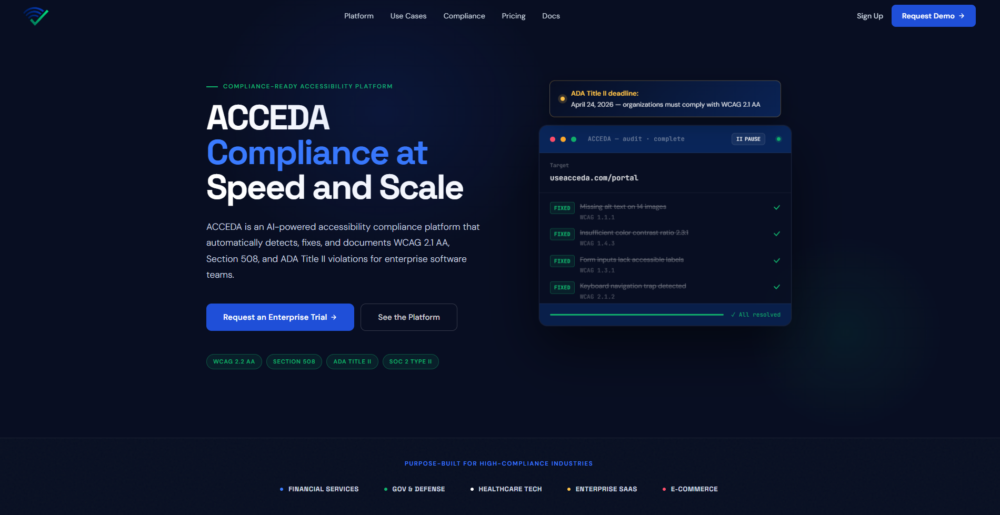

# 

<div align="center">
  <h3>Compliance at Speed and Scale</h3>
</div>

---

<div align="center">
  <p>
    <a href="https://useacceda.com">useACCEDA</a> • 
    <a href="https://useacceda.com/privacy">Privacy Policy</a> • 
    <a href="https://useacceda.com/terms">Terms of Service</a> • 
    <a href="https://useacceda.com/accessibility">Accessibility Statement</a>
  </p>
</div>

---

## 🎯 The Problem

Digital accessibility is a legal requirement, not a feature. Yet, most organizations struggle to implement it effectively. Manual audits are time-consuming and expensive, while automated tools often provide incomplete or inaccurate results. This leaves businesses vulnerable to lawsuits and unable to serve all users.

## 🛡️ The Mission

ACCEDA is a Compliance-Ready accessibility platform designed to automate the detection, remediation, and documentation of digital accessibility violations. We enable organizations to ship accessible products with confidence, moving from audit fatigue to continuous compliance.

## 🚀 Core Platform Capabilities

### 🔍 Detection

Deep-crawl your web applications for **WCAG violations**. Every page, every state, every interaction — surfaced and prioritized automatically using our high-fidelity scan engine.

### 🛠️ Remediation

Receive exact code diffs and step-by-step implementation guides for every finding. Your engineers ship fixes in minutes, not sprints, with AI-driven recommendations.

### 📊 Reporting

Auto-compile your full audit history into compliance-ready **Voluntary Product Accessibility Templates (VPAT)** on demand. Generate the legal evidence required for enterprise procurement.

### 🚧 CI/CD Integration

Block non-compliant code from merging. Accessibility guardrails integrate directly into your existing development pipelines (GitHub Actions, GitLab CI, etc.).

### 💻 Audio & Video Captions

Automatically transcribe and caption media assets. **Every video and audio file** — made accessible without manual effort.

---

## ⌛ The ADA Title II Mandate

**Deadline: April 24, 2026**
The U.S. Department of Justice has finalized a rule requiring all public entities to meet WCAG 2.1 Level AA. ACCEDA is the primary tool for organizations to bridge the gap between their current state and the incoming mandatory transition.

## 🛠️ Technical Stack

Built with enterprise stability and modern performance in mind:

- **Framework**: [Next.js](https://nextjs.org/) (App Router, Turbopack)
- **Animations**: [Framer Motion](https://www.framer.com/motion/)
- **Styling**: Vanilla CSS & Dynamic Design System
- **Communication**: [Resend](https://resend.com/) for automated lead capture
- **Compliance**: Built to verify WCAG 2.1/2.2 AA, Section 508, and ADA Title II.

---

## 💻 Getting Started

### Prerequisites

- Node.js 18.x or later
- NPM / PNPM / Bun

### Installation

```bash
# Clone the repository
git clone https://github.com/your-org/acceda-react.git

# Install dependencies
npm install

# Set up environment variables
cp .env.example .env.local

# Run the development server
npm run dev
```

### Environment Variables

To ensure the platform functions correctly, configure the following in your `.env.local`:

- `RESEND_API_KEY`: API key for lead notifications.
- `LEAD_RECEIVER_EMAIL`: Internal email for demo requests.
- `NEXT_PUBLIC_APP_URL`: Your deployment domain.
- `NEXT_PUBLIC_CAL_DEMO_URL`: Enterprise demo booking link.

---

## ♿ Accessibility Commitment

As an accessibility company, we lead by example. This landing page is continuously audited using the ACCEDA engine to ensure 100% conformance with WCAG 2.1 AA standards, including:

- Semantic HTML5 structure
- Accessible Name & Role verification
- High contrast ratios (WCAG 2 AA minimum)
- Keyboard-only navigation support
- Screen reader optimized interactive components

---

<div align="center">
  <p>
    <a href="https://useacceda.com">useACCEDA.com</a> • 
    <a href="https://useacceda.com/privacy">Privacy Policy</a> • 
    <a href="https://useacceda.com/terms">Terms of Service</a> • 
    <a href="https://useacceda.com/accessibility">Accessibility Statement</a>
  </p>
  <p>© 2026 ACCEDA. All rights reserved.</p>
</div>
